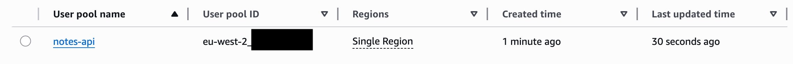
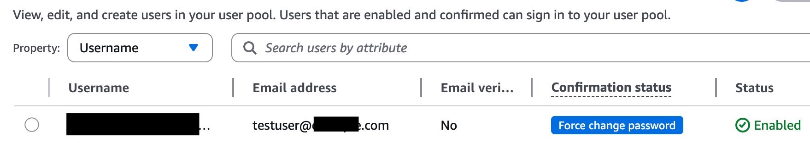
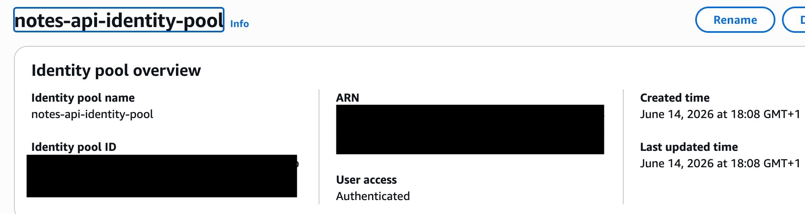
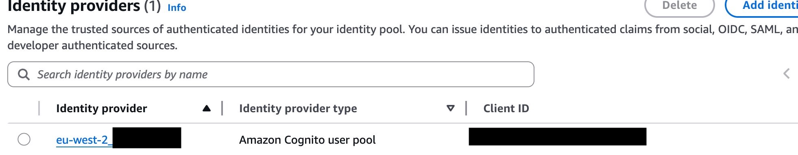
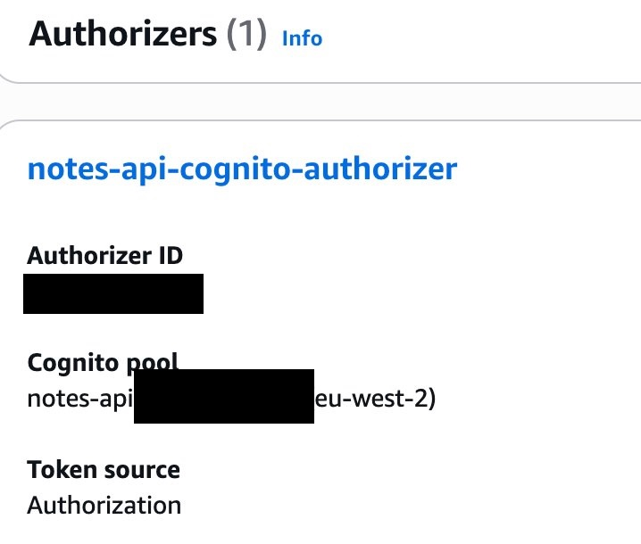
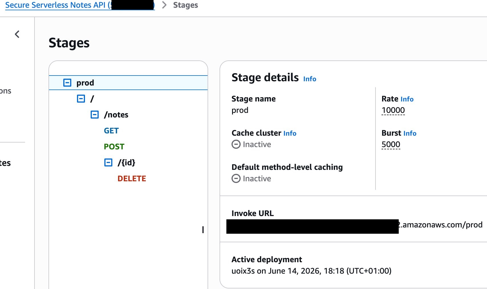
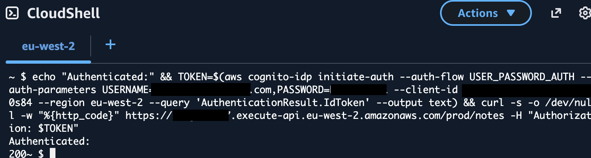

# 🔐 AWS Cognito Authentication

[↩️ Back to AWS Cloud Engineering](../)  
[📁 Back to Projects Index](../../)

---

## Overview

This project secures the Serverless Notes API using Amazon Cognito, demonstrating how authentication and identity controls are applied to cloud APIs in a production pattern.

All endpoints are protected at the API Gateway layer. Unauthenticated requests are rejected before they reach Lambda or DynamoDB.

---

## What This Shows

- Ability to add authentication to an existing serverless API without changing application code
- Understanding of the difference between User Pools (authentication) and Identity Pools (authorisation and AWS credential issuance)
- Applying least privilege with guest access disabled and authenticated users only
- Token based API security using Cognito ID tokens passed via Authorization header
- End to end thinking from user directory to API protection to live testing

---

## Cognito User Pool

A user directory with email sign in controls who can authenticate into the API.

  

<em>User Pool created in eu-west-2 with email sign-in enabled</em>

  

<em>Test user created, enabled, and ready for authentication</em>

---

## Identity Pool

Issues temporary AWS credentials to authenticated users only. Guest access is explicitly disabled, enforcing least privilege at the identity layer.

  

<em>Identity Pool configured with authenticated access only — no guest credentials issued</em>

---

## Identity Provider Trust

The User Pool is configured as the trusted identity source. Only tokens issued by this pool are accepted.

  

<em>User Pool linked as the sole trusted identity provider with App Client ID registered</em>

---

## API Gateway Authorizer

Cognito authorizer attached to all routes including GET, POST, and DELETE. Requests without a valid token are blocked before reaching any backend resource.

  

<em>Cognito authorizer attached to the API with token source set to the Authorization header</em>

---

## Production Deployment

API redeployed to the prod stage with authentication enforced across all endpoints.

  

<em>API Gateway prod stage showing active deployment with all secured routes</em>

---

## Security Validation

### Unauthenticated Request Blocked

No token provided. API Gateway rejects the request at the authorizer layer. Lambda and DynamoDB are never reached.

  

<em>Request without a token returns 401 Unauthorized — rejected at the API Gateway layer</em>

### Authenticated Request Approved

Valid Cognito ID token passed in the Authorization header. Request succeeds and data is returned.

  

<em>Request with a valid Cognito ID token returns HTTP 200 confirming authentication is working</em>

---

## Engineering Considerations

- Token expiry is 1 hour. A production implementation would use refresh tokens or a token management library
- The test user email is unverified. A production setup would require email verification before sign in
- Cognito hosted UI or a frontend could be added to handle sign in flows without CLI commands
- CloudWatch logs would capture auth failures for monitoring and alerting

---

> 🔒 Public safe evidence only. All users and resources are lab based. No account IDs, secrets, or production data included.
