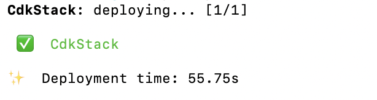

# 🟧 AWS Secure Serverless Notes API

[↩️ Back to AWS Cloud Engineering](../)  
[📁 Back to Projects Index](../../)

---

## Overview

A production-pattern serverless notes API built and deployed entirely through code using AWS CDK, API Gateway, Lambda, DynamoDB, IAM, and CloudWatch.

| Area | Detail |
|---|---|
| **Platform** | Amazon Web Services (AWS) |
| **Language** | Python |
| **Deployment** | AWS CDK → CloudFormation |
| **Architecture** | API Gateway → Lambda → DynamoDB |

---

## Skills Demonstrated

| Skill | Evidence |
|---|---|
| **Infrastructure as Code** | Full stack defined and deployed using AWS CDK in Python |
| **Serverless Architecture** | API Gateway → Lambda → DynamoDB — no server management |
| **API Design** | REST API with Create, Read, and Delete note endpoints |
| **Cloud Security** | IAM role scoped to least-privilege DynamoDB access only |
| **Operational Logging** | CloudWatch logs capturing Lambda execution and API activity |
| **Cost-Aware Design** | Pay-per-use serverless services — no idle compute cost |

---

## Deployment Evidence

### CDK Stack Deployed

### API POST — Note Created Successfully

### DynamoDB — Item Stored and Verified

---

## Future Improvements

- Add Cognito authentication for user-specific note access
- Add CloudWatch alarms for error rate monitoring
- Add GitHub Actions CI/CD deployment pipeline
- Add S3 and CloudFront for frontend hosting

---

> 🔒 Public-safe evidence only. No secrets, access keys, account IDs, production records, or confidential data are included.
